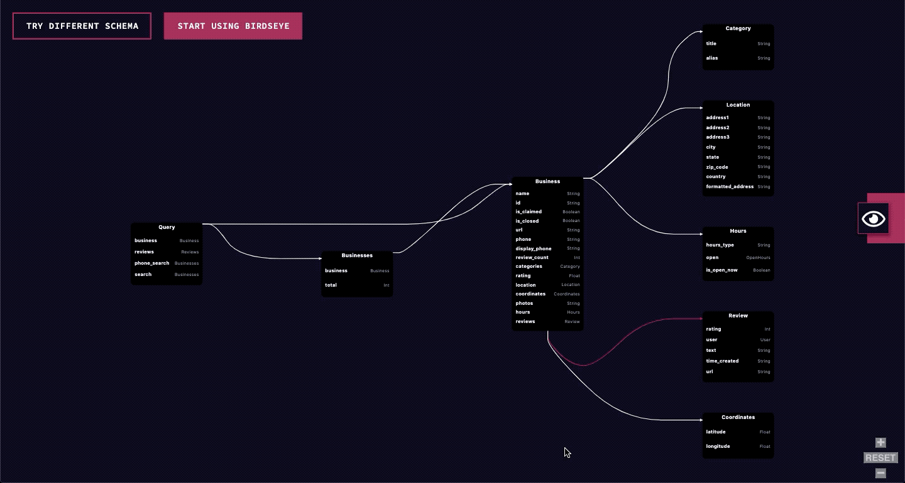

<div align="center"></br></br>
Birdseye is a dynamic and interactive tool that allows you to visualize any GraphQL schema. </br>
Try it out now: http://birdseye.novvum.io/</br></br>



[](https://www.npmjs.com/package/graphql-birdseye) [](https://standardjs.com)


</div>

### Description

Birdseye gives you the ability to view any GraphQL schema as a dynamic and interactive graph. It helps teams understand and visualize the nodes and connections within their GraphQL schema. Birdseye was built using jointJS and makes for a lightweight addition to any React project.

Birdseye was heavily inspired by [GraphQL Voyager](https://github.com/APIs-guru/graphql-voyager) and the folks at [Apis-guru](https://github.com/APIs-guru). We found that Voyager would add 1.2 MB to the projects we wanted to use it in, which was too big for us. We solved our problem by creating Birdseye, which has a bundle size of less than 200 KB. Birdseye is open source and free for any developers to use and explore.

[](https://codesandbox.io/s/xp9mp9rzwo)

### Features

1. Graphical view of any GraphQL schema
2. Click on a field or type to view its connections
3. Dynamic zooming style of navigation to focus on portions of the graph
4. Add to any React project
5. Customizable theming

### Installation

Install using NPM or yarn

##### NPM

```bash
npm install --save graphql-birdseye
```

##### Yarn

```bash
yarn add graphql-birdseye
```

### Usage
Here’s an example of how to use Birdseye in a React project. See the API Reference for how to pass your schema to the component.

```tsx
import * as React from 'react';

import GraphqlBirdseye from 'graphql-birdseye';

class Example extends React.Component {
  render() {
    return <GraphqlBirdseye schema={this.props.schema} />;
  }
}
```
See a full [example](https://github.com/Novvum/graphql-birdseye/tree/master/example) in the repository.
### API
|Name|Type|Description|
|---|---|---|
|introspectionQuery|JSON object|Pass your schema as a JSON of an introspection query response. Use this [introspection query](https://github.com/Novvum/graphql-birdseye/blob/master/example/src/utils/introspectionQuery.tsx) to return your schema as a GraphQL schema object.|
|schema|GraphQL schema object|Pass your schema as a GraphQL schema object. Return using [makeExecutableSchema](https://www.apollographql.com/docs/apollo-server/api/graphql-tools#makeExecutableSchema) from GraphQL tools.|
|style|object|Pass in an object to style the container|
|theme|object|An object defining the theme of the components. See a full [example](https://github.com/Novvum/graphql-birdseye/tree/master/example).|

### RoadMap
1. Improve performance for larger schemas
2. Option to toggle zoom navigation style
3. Smoother UI transitions and interactions

### Contributing
This is an open source project. To learn how to contribute, please check out our contributor guidelines (coming soon).

### License

MIT © [Novvum](https://github.com/novvum)

---

<p align="center">Made with ❤️ by <a href="https://www.novvum.io">Novvum</a></p>
