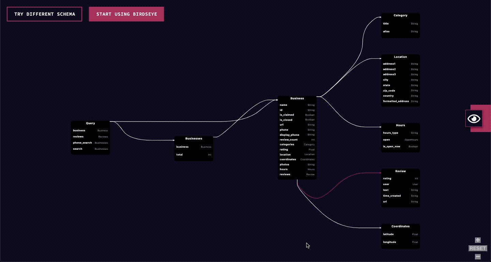

<div align="center"></br></br>
View any GraphQL schema as a dynamic and interactive graph.</br>
Try it out now: http://birdseye.novvum.io/</br></br>


</div>

[](https://www.npmjs.com/package/graphql-birdseye-core) [](https://standardjs.com)

### Description

Birdseye is an interactive tool that dynamically displays GraphQL schemas. It helps teams visualize and understand the nodes and connections within their schema. Birdseye was built using jointJS and makes for a lightweight addition to any web project.

### Features

1. Graphical view of any GraphQL schema
2. Ability to click on a field or type to view its connections
3. Dynamic zooming to focus on small portions of the schema at a time
4. Add to any web project
5. Customizable styling and theming

### Javascript Library Documentation

This is the documentation to use Birdseye as a Javascript library. To learn how to use Birdseye as a React package, please refer to the React repository [README](../../packages/react/README.md).

### Installation

Install using NPM or yarn

##### NPM

```bash
npm install --save graphql-birdseye-core
```

##### Yarn

```bash
yarn add graphql-birdseye-core
```

### Usage

Here’s an example of how to use the Birdseye Javascript library in a React project. See the API Reference for how to pass your schema to the component.

```javascript
import {
  GraphqlBirdseye,
  IntrospectionDataStructure,
} from "graphql-birdseye-core";
import $ from "jquery";
// Instantiate the library
const birdseye = new GraphqlBirdseye();

// define the data structure
const introspectionQuery = getSchemaIntrospection(); // get the introspection response from the schema
const dataStructure = new IntrospectionDataStructure(
  introspectionQuery.__schema
);

// Initialize the library
birdseye.init(
  $("#graphql-birdseye"), // the html div element to mount the library to.
  { width: 500, height: 500 }, // object to define the size of the container
  dataStructure
);
```

### API

##### `const birdseye = new GraphqlBirdseye({ theme })`
Creates a Birdseye object.

|Name|Type|Description|
|---|---|---|
|theme (optional)|object|An object defining the theme of the components. Theme objects should follow the type defined [here](../../example/src/styled/theme/interface.ts). Here's a full [example](../../example/src/styled/theme/birdseyeTheme.ts).|

##### `init(el, bounds, dataStructure)`
Initializes the Birdseye diagram with the GraphQL schema to display, the DOM element to attach it to, and its size.

|Name|Type|Description|
|---|---|---|
|`el`|[HTML DOM Element](https://www.w3schools.com/jsref/dom_obj_all.asp)|The HTML element on which to mount the Birdseye diagram.|
|`bounds`|object|The height and width of the diagram.<br/>`width`: Int<br/>`height`: Int|
|`dataStructure`|[BirdseyeDataStructure](#birdseyedatastructure)|The GraphQL schema to display, expressed as a Birdseye Data Structure. Read more about Birdseye Data Structures below.|

##### `setDataStructure(newDataStructure)`
Updates the GraphQL schema displayed in the Birdseye diagram.

|Name|Type|Description|
|---|---|---|
|`newDataStructure`|[BirdseyeDataStructure](#birdseyedatastructure)|The GraphQL schema to display, expressed as a Birdseye Data Structure. Read more about Birdseye Data Structure below.|

##### `setActiveType(activeType)`
Changes the active type selected on the diagram. This function fires whenever a type is clicked, but it can also be used to change the active type manually.

|Name|Type|Description|
|---|---|---|
|`activeType`|String|The `name` value of the `Type` object from the Birdseye Data Structure.|

##### `setSize(width, height)`
Updates the width and height of the Birdseye diagram.

|Name|Type|Description|
|---|---|---|
|`width`|int|The width of the diagram.|
|`height`|int|The height of the diagram.|

##### `on(event, callback)`
Invokes a function when a type is clicked and the diagram is loading. It can invoke a function when the loading begins or when the loading ends.

|Name|Type|Description|
|---|---|---|
|`event`|String|Use either:<br/>`"loading:start"`<br/>`"loading:stop"`|
|`callback`|() => any|The function that will be invoked when the event triggers.|

#### BirdseyeDataStructure

Birdseye accepts GraphQL schemas defined in the Birdseye Data Structure. We chose to specify our own data structure because GraphQL schemas can be represented in various formats (i.e. introspection response, GraphQL Schema Object, etc.). Birdseye ships with two translators to create Birdseye Data Structures.

- [`introspectionConverter`](./src/graphql/introspectionConverter.ts): Converts the response of an [introspection](https://graphql.org/learn/introspection/) query into a Birdseye Data Structure. Use the response from this [introspection query](../../example/src/utils/introspectionQuery.tsx) with this converter.
- [`schemaConverter`](./src/graphql/schemaConverter.ts): Converts a [GraphQL Schema](https://graphql.org/graphql-js/type/#graphqlschema) Object into a Birdseye Data Structure. You can use the [ExecutableSchema](https://www.apollographql.com/docs/apollo-server/api/graphql-tools/#makeExecutableSchema) from GraphQL tools to create a GrapahQL Schema Object.

### Roadmap
We have plans to keep improving Birdseye. Here's what is next:
1. Improve performance for larger schemas
2. Option to toggle zoom navigation style
3. Smoother UI transitions and interactions

### Contributing
This is an open source project. To learn how to contribute, please check out our [contributing guide](../../CONTRIBUTING.md#contributing-guide).

### License

MIT © [Novvum](https://github.com/novvum)

---

<p align="center">Made with ❤️ by <a href="https://www.novvum.io">Novvum</a></p>